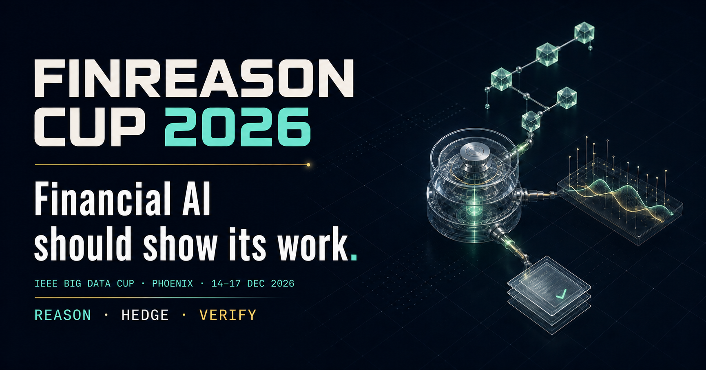

<p align="center">
  
</p>

<h1 align="center">FinReason Cup 2026</h1>

<p align="center">
  <strong>Agentic Financial Reasoning, Hedging &amp; Audit</strong><br>
  IEEE Big Data Cup 2026 · Phoenix, Arizona · 14–17 December 2026
</p>

<p align="center">
  <a href="https://the-finai.github.io/IEEE-bigdata-cup/"><strong>Official website</strong></a>
  ·
  <a href="https://wi-lab.com/cyberchair/2026/bigdata26/scripts/submit.php?subarea=SC03"><strong>Submit challenge paper</strong></a>
  ·
  <a href="https://forms.gle/D4VJqjgtmcaC77DL8"><strong>Submit Letter of Intent</strong></a>
  ·
  <a href="https://the-finai.github.io/IEEE-bigdata-cup/terms/"><strong>Terms</strong></a>
  ·
  <a href="https://the-finai.github.io/IEEE-bigdata-cup/privacy/"><strong>Privacy</strong></a>
  ·
  <a href="https://bigdataieee.org/BigData2026/cup/"><strong>IEEE Cup overview</strong></a>
</p>

## About the challenge

FinReason Cup is Challenge 03 of the [IEEE Big Data Cup
2026](https://bigdataieee.org/BigData2026/cup/). It asks a central question for
financial AI: **can a system's reasoning be executed, checked, and
reproduced—not merely presented as a plausible answer?**

The competition brings together three complementary tasks spanning symbolic
reasoning, sequential financial decisions, and structured verification.

## Competition tasks

### Task 1 · Verifiable Financial Chain Reasoning

Solve multi-step financial problems and return both a final answer and a
step-by-step reasoning trace. Predictions are planned to be checked against
gold traces generated from executable [FinChain](https://github.com/mbzuai-nlp/finchain)
templates.

The exact problem subset, trace schema, ChainEval version, and numerical
tolerance policy will be frozen with the starter kit.

### Task 2 · Market-Neutral Hedging

Select an asset pair and manage a zero-net-dollar position over time using
point-in-time prices, news, and corporate filings. The task is designed to
reward relative-value reasoning rather than unhedged directional exposure.

The planned data are derived from
[HERCULEAN](https://arxiv.org/abs/2605.14355). Exact market windows, eligible
assets, execution assumptions, transaction costs, and position-validity rules
will be published with the dataset and scorer.

### Task 3 · Financial Audit Verification

Perform targeted numeric-fact verification on organizer-packaged SEC EDGAR
XBRL filing materials by comparing reported values with values derived from
their calculation context. This task is **not** a full financial-statement
audit.

The planned release combines public filing cases and separately constructed
held-out cases subject to leakage review.

## Planned evaluation

| Task | Provisional evaluation |
| --- | --- |
| Task 1 · Reason | Final-answer accuracy and step-level ChainEval |
| Task 2 · Hedge | Cumulative return, Sharpe ratio, and maximum drawdown |
| Task 3 · Verify | Accuracy and structural, extraction, and calculation error rates |

Final scoring formulas, tolerances, tie-break procedures, submission contracts,
and validity rules will be published with the public scorers.

## Final paper and solution submission

Teams seeking final ranking and awards must submit a challenge paper through
the official [FinReason Cup SC03 track in
CyberChair](https://wi-lab.com/cyberchair/2026/bigdata26/scripts/submit.php?subarea=SC03).

- Length: up to 6 pages total, including references
- Format: [IEEE two-column conference
  template](https://www.ieee.org/conferences/publishing/templates.html)
- Deadline: 15 November 2026, 23:59 Anywhere on Earth

CyberChair has not yet updated its displayed deadline and currently shows a
10-page upload limit. The FinReason Cup organizer deadline is 15 November 2026,
23:59 Anywhere on Earth, and FinReason teams should follow the challenge
requirement above and submit no more than 6 pages total, including references.

The paper portal is separate from the competition submission path. The final
task rules will specify which solution materials each team must provide,
including any required predictions, source code, and reproducibility materials.
They will use the verified competition link published on the official challenge
website after organizer testing. Both routes share the 15 November deadline.

Submission does not guarantee publication. Any publication is subject to
conference peer review, acceptance, camera-ready submission, registration, and
presentation requirements.

## Participant access

Teams planning to participate should submit **one Letter of Intent per team**:

**[Submit the FinReason Cup Letter of Intent →](https://forms.gle/D4VJqjgtmcaC77DL8)**

The LOI supports challenge planning, organizer communication, and aggregate
participation statistics. It does not replace either the challenge paper or the
final competition submission.

### Current release status

| Resource | Status |
| --- | --- |
| [Official challenge website](https://the-finai.github.io/IEEE-bigdata-cup/) | Live |
| [Letter of Intent](https://forms.gle/D4VJqjgtmcaC77DL8) | Open |
| Task 1 train questions, answers, and targets | Prepared; public link pending verification |
| Task 1 development questions and immediate leaderboard | Prepared; public link pending verification |
| Task 1 test questions and receipt-only submission | Prepared; public link pending verification |
| Starter kits, schemas, validators, and baselines | Coming soon |
| Participant support | [zhuohan.xie@mbzuai.ac.ae](mailto:zhuohan.xie@mbzuai.ac.ae) |
| Terms of Participation | Ready in the current release branch; public after website deployment |
| Privacy Notice | Ready in the current release branch; public after website deployment |
| [Challenge paper submission](https://wi-lab.com/cyberchair/2026/bigdata26/scripts/submit.php?subarea=SC03) | Open |
| [Task 1 submission hub](https://the-finai.github.io/IEEE-bigdata-cup/task1/submit/) | Development and test Space links controlled at build time |
| [Task 1 leaderboard hub](https://the-finai.github.io/IEEE-bigdata-cup/task1/leaderboard/) | Development Space link controlled at build time |

Final verified competition-platform and submission links will be posted on the
official challenge website after workflow testing.

## Schedule

| Milestone | Date |
| --- | --- |
| Final challenge paper and solution materials | **15 November 2026, 23:59 AoE** |
| Winning teams announced | **25 November 2026** |
| IEEE Big Data 2026, Phoenix, Arizona | **14–17 December 2026** |

Dataset, starter kit, competition-platform, and private-evaluation dates will be
published on the official challenge website after organizer testing.

## Repository scope

This repository currently contains the source for the organizer-maintained
FinReason Cup website. Verified participant resources—including datasets,
starter kits, schemas, validators, baselines, and submission links—will be
linked here as they are released.

Please use only links marked as verified on the
[official challenge website](https://the-finai.github.io/IEEE-bigdata-cup/).

### Task 1 Pages hub

The public Task 1 routes provide a stable participant entry point while the
submission service is prepared:

- `/task1/submit/` points to separate organizer-verified development and test
  Hugging Face Spaces after both URLs are supplied at build time;
- `/task1/leaderboard/` points only to the development Space for submission,
  scores, and development leaderboard access;
- registered teams receive a private access code from the organizers and enter
  it only inside the relevant Space;
- an optional public JSON endpoint can add an aggregate development table to
  the Pages leaderboard route without becoming a launch dependency;
- the verified participant release provides train questions and answers, with no
  train leaderboard;
- accepted development submissions return immediate SeenFAC and SeenCheckpoint
  and can enter the authenticated development leaderboard;
- accepted test submissions return a receipt only, with no online score and no
  test leaderboard;
- GitHub Issues are not a participant submission channel.

No live Hugging Face URL is stored in the repository. The safe default is a
development preview build with all Space links unavailable. Copy the variable
names from
[`docs/task1-site.env.example`](docs/task1-site.env.example) and set values only
after the public endpoints have been verified:

| Variable | Behavior |
| --- | --- |
| `FINREASON_TASK1_SITE_MODE=development` | Both pages stay in the not-yet-live preview state, even if endpoint values are staged. This is a Pages deployment state, not the competition development phase. |
| `FINREASON_TASK1_SITE_MODE=final` | The build requires two distinct verified root `*.hf.space` HTTPS URLs. A malformed optional API URL also fails the build. `final` means the Pages links are live; it is not a competition phase and does not mean test scoring is live. |
| `NEXT_PUBLIC_FINREASON_TASK1_DEVELOPMENT_SPACE_URL` | Root HTTPS URL of the organizer-verified development Space. Query strings, fragments, credentials, ports, and subpaths are rejected. |
| `NEXT_PUBLIC_FINREASON_TASK1_TEST_SPACE_URL` | Root HTTPS URL of the separate organizer-verified test Space. It follows the same root-URL restrictions and must differ from the development URL. |
| `NEXT_PUBLIC_FINREASON_TASK1_LEADERBOARD_API_URL` | Optional CORS-enabled public aggregate JSON extension. |

In `final` mode, both Space URLs and the optional leaderboard URL are embedded
in the public static artifact. Development preview mode does not render staged
endpoint values. Public URLs must not contain access tokens, signed credentials,
or other secrets. The aggregate endpoint must be anonymously readable and
return only the public contract below. Team access codes are issued privately
by the organizers and entered only in the relevant Space. GitHub Pages must not
receive or store access codes, submissions, gold answers, or private evaluation
data.

When configured, the public endpoint must return the canonical aggregate-only
development leaderboard contract below. Its root and row fields are exact; it
must not expose predictions, attachments, email addresses, private evaluation
data, or additional metadata. The response must be no larger than 1 MiB.

```json
{
  "schema_version": "finreason.task1.development-leaderboard/1.0.0",
  "phase": "development",
  "rows": [
    {
      "rank": 1,
      "team_id": "team-example",
      "team_display_name": "Example team",
      "seen_fac": "0.900000",
      "seen_checkpoint": "0.800000",
      "submission_id": "dev-20260831T120000Z-team-example-aaaaaaaaaaaaaaaaaaaaaaaaaaaaaaaaaaaaaaaaaaaaaaaaaaaaaaaaaaaaaaaa",
      "accepted_at": "2026-08-31T12:00:00Z"
    }
  ]
}
```

The deployed Pages workflow reads the same names from GitHub repository
variables. It defaults to `development`; changing the repository variable to
`final` activates both verified public Space links. This mode name describes the
live Pages deployment state, not a competition phase. Development scores and the
development leaderboard remain available in the isolated development Space to
registered teams using their organizer-issued private access code, even when the
optional public API is unset or temporarily unavailable. The isolated test Space
returns receipts only and is never linked from the leaderboard page. Test
submissions are excluded from all online leaderboard projections. Changing
repository variables does not
deploy the site by itself; after setting them, run the existing Pages
`workflow_dispatch` on `main` and verify both Task 1 routes in the deployed
artifact. The isolated GitHub Issue pilot neither rebuilds nor dispatches the
official Pages deployment.

To withdraw previously active Space links, set
`FINREASON_TASK1_SITE_MODE=development`, dispatch the Pages workflow on `main`,
and verify that both Task 1 routes show their pending state without disclosing
either staged URL. Clearing one URL while leaving mode set to `final` is not a
withdrawal because the build fails safely and the previous Pages artifact
remains live.

## Local development

Requirements: Node.js 22.13 or newer.

```bash
npm ci
npm run dev
```

Open <http://localhost:3000>.

Run the same checks used by the GitHub Pages workflow:

```bash
npm run lint
npm test
```

`npm test` builds the static GitHub Pages export and validates its rendered HTML
contract. Pushes to `main` deploy through
[`.github/workflows/deploy-pages.yml`](.github/workflows/deploy-pages.yml).

## Data-use notice

The Letter of Intent is hosted on Google Forms. Responses are available to the
organizer team and are used for challenge operations, communication permitted
by the form, and aggregate reporting. Do not include sensitive information.
Participant support, privacy questions, and correction or deletion requests can
be sent to [zhuohan.xie@mbzuai.ac.ae](mailto:zhuohan.xie@mbzuai.ac.ae). See the
[Privacy Notice](https://the-finai.github.io/IEEE-bigdata-cup/privacy/) for the
public website boundary, public leaderboard fields, external services, and the
Task 1 retention policy. Private Task 1 submission archives and non-public
operational event records are retained for up to 120 days from acceptance,
subject to the exceptions stated in that notice.

## Organizers

The organizer team is led by [The Fin AI](https://thefin.ai/), with
contributors affiliated with MBZUAI, McGill University, Stevens Institute of
Technology, Yale University, and the University of Manchester. Affiliations do
not imply institutional sponsorship.

Task-specific dates, platform settings, award categories, and resource licenses
are published only after organizer verification. The
[Terms of Participation](https://the-finai.github.io/IEEE-bigdata-cup/terms/)
describe the current organizer-maintained participation rules.

---

Last reviewed: 1 September 2026.
